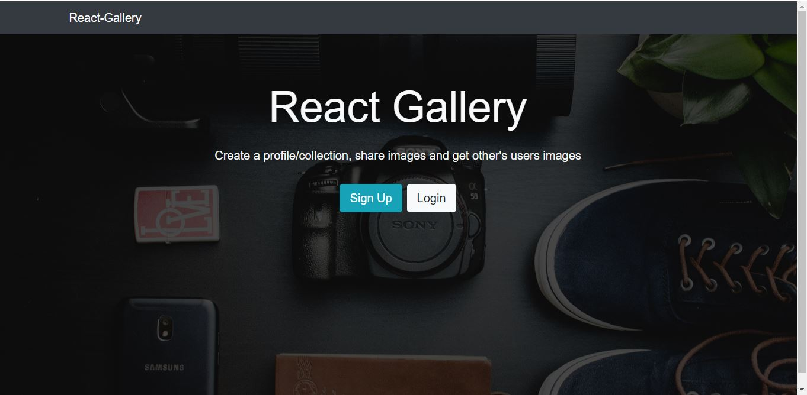
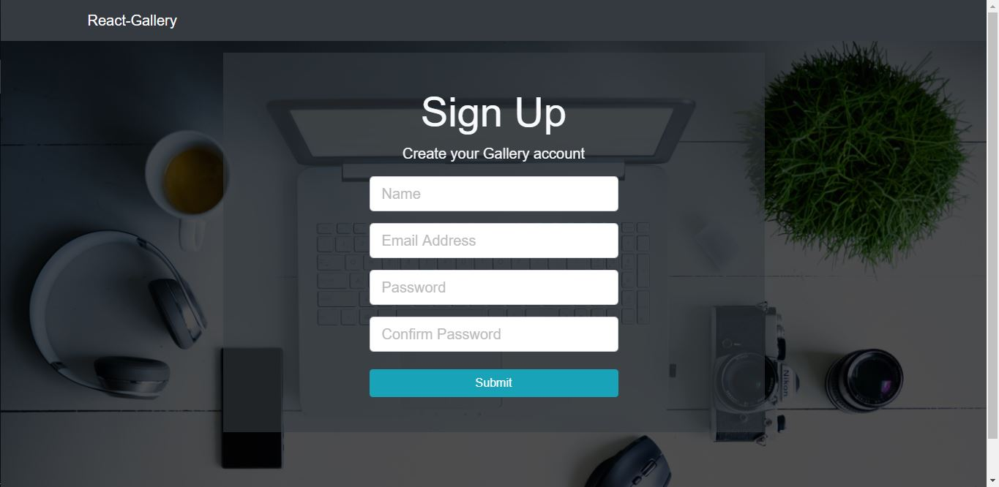
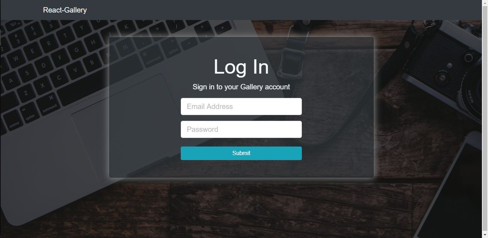

This is landing page of the "React-Gallery-App". Where user can register and registered user can sign in in the app.

Register page look like this and user can provide the detail and get registered.

This is Login component that will take the registered user detail and allow to go into the app.

